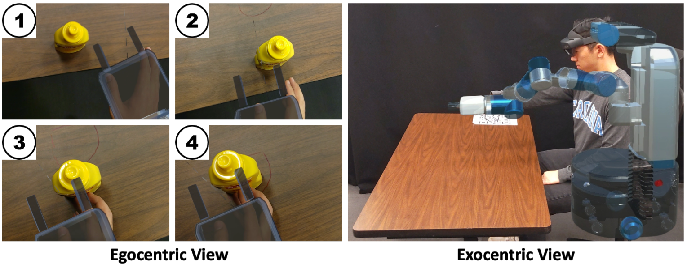

To collect demonstrations we utilized the Microsoft HoloLens 2, an Augmented Reality Head-Mounted Display (ARHMD). The HoloLens 2 tracks both the position and orientation of the wearer's hands, allowing us to map the user's hand movements to the robot during the initial demonstration. It also enables the visualization of virtual imagery, which we use to align a digital twin of the robot with the user's movements during the demonstration and to display candidate demonstrations for the user to review and select for the accepted demonstration set. Directions on how to setup and utilize our code for the HoloLens can be found in the [Unity_ROS branch](https://github.com/YY-GX/ARCADE/tree/Unity_ROS).

  <!-- Image -->
  

  <!-- Video -->
  <video width="50%" height="auto" controls>
    <source src="../../assets/videos/push_ar.mp4" type="video/mp4">
    Your browser does not support the video tag.
  </video>

