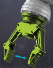
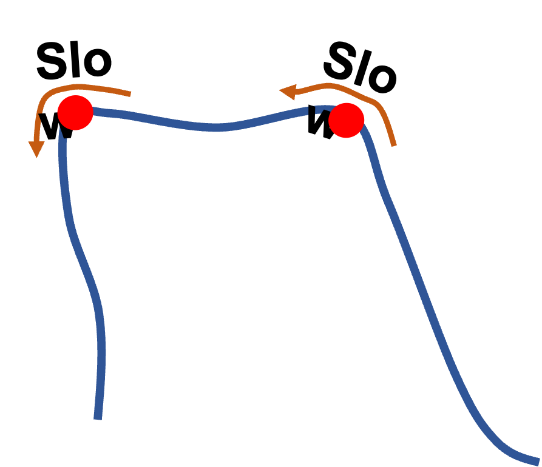
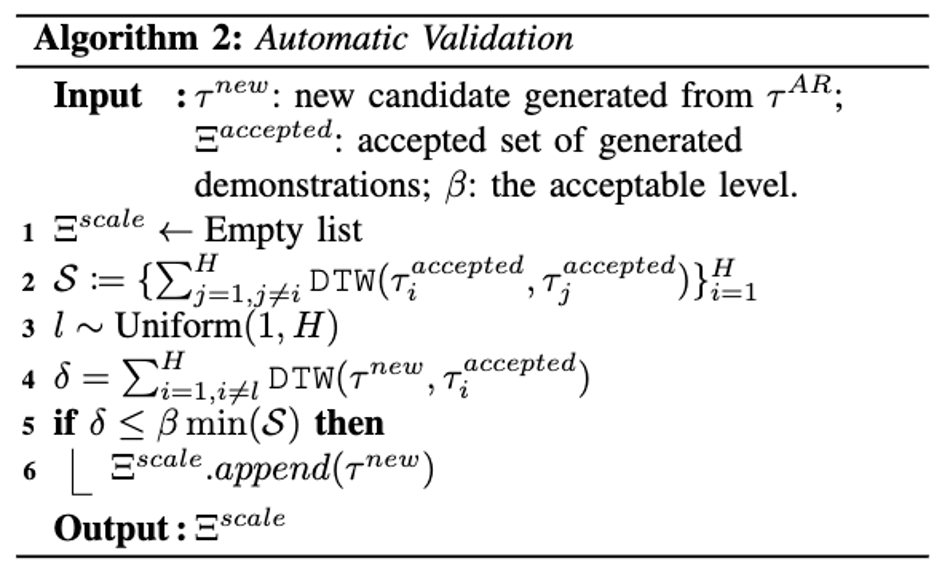

Generate additional demonstrations by following **sampled waypoints** + **key waypoints** from the single human-derived demonstration.

To obtain **key waypoints**, we propose the `Key-Poses Detector`, which assumes that key waypoints happen in 2 cases:

  
  

To avoid robot's unnatural behaviors when following waypoints, we include the `User Validation` step where we visualize the generated demonstrations in AR and the user decides to accept or reject.

  <!-- Video 1 with caption -->
  

    <video width="480" height="270" controls>
      <source src="../../assets/videos/accept_case.mp4" type="video/mp4">
      Your browser does not support the video tag.
    </video>
    
Accept case (3x speed)

  

  <!-- Video 2 with caption -->
  

    <video width="480" height="270" controls>
      <source src="../../assets/videos/reject_case.mp4" type="video/mp4">
      Your browser does not support the video tag.
    </video>
    
Reject case (3x speed)

  

However, validating many demonstrations may still be labor-intensive, even with limited user roles. So we introduce the `Automatic Validation`:

